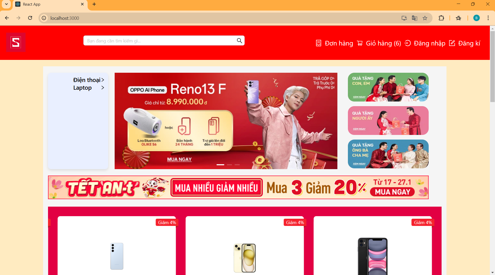
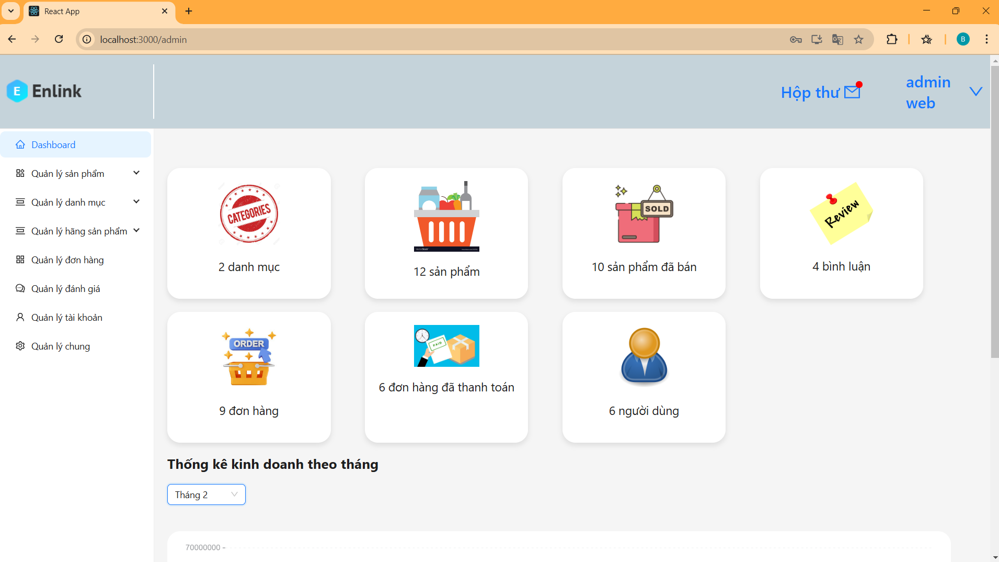

# ReactJS E-Commerce Project

Dự án này là một ứng dụng thương mại điện tử được xây dựng bằng **ReactJS**. Dưới đây là các tính năng chính và các công nghệ mà dự án sử dụng.

## Trang home

## Trang admin

## Các công nghệ sử dụng

- **React**: Xây dựng giao diện người dùng với ReactJS.
- **Ant Design**: Thư viện UI để xây dựng các thành phần giao diện.
- **Redux**: Quản lý trạng thái ứng dụng.
- **JWT**: Xác thực người dùng và bảo mật API.
- **React Router**: Quản lý điều hướng trang trong ứng dụng.
- **Sass**: Sử dụng Sass để viết CSS có cấu trúc hơn.
- **Stompjs,Sockjs-Client**: WebSocket
